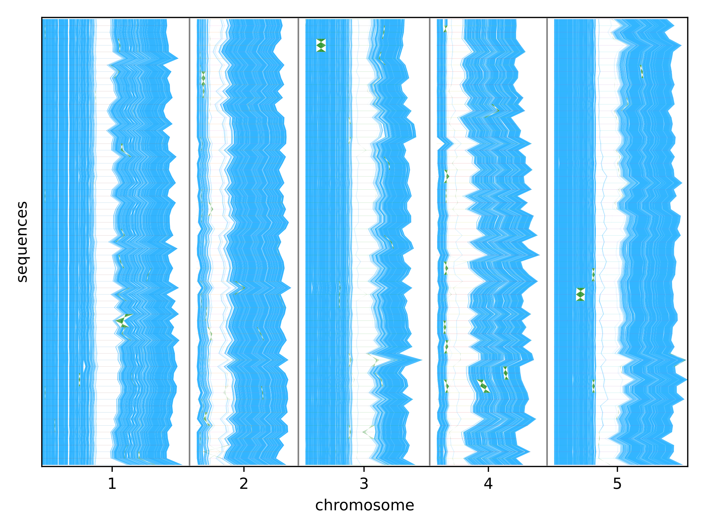
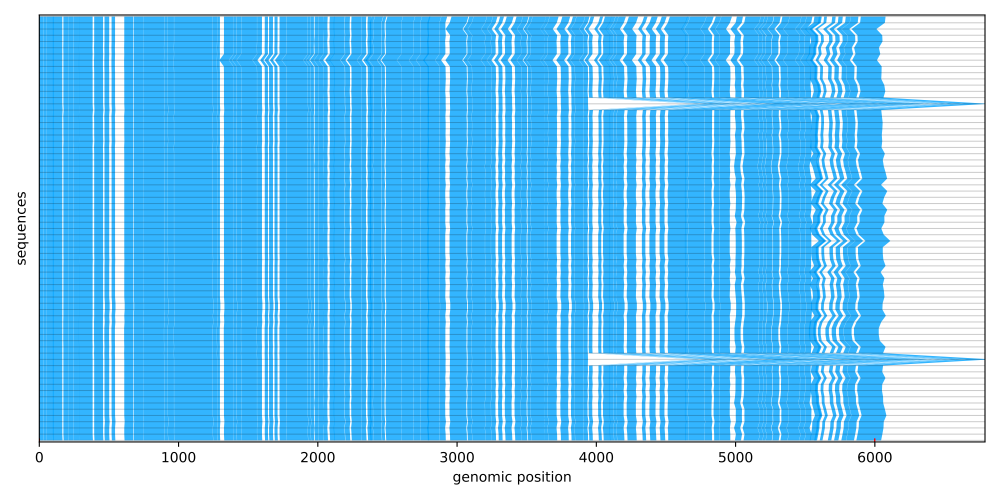
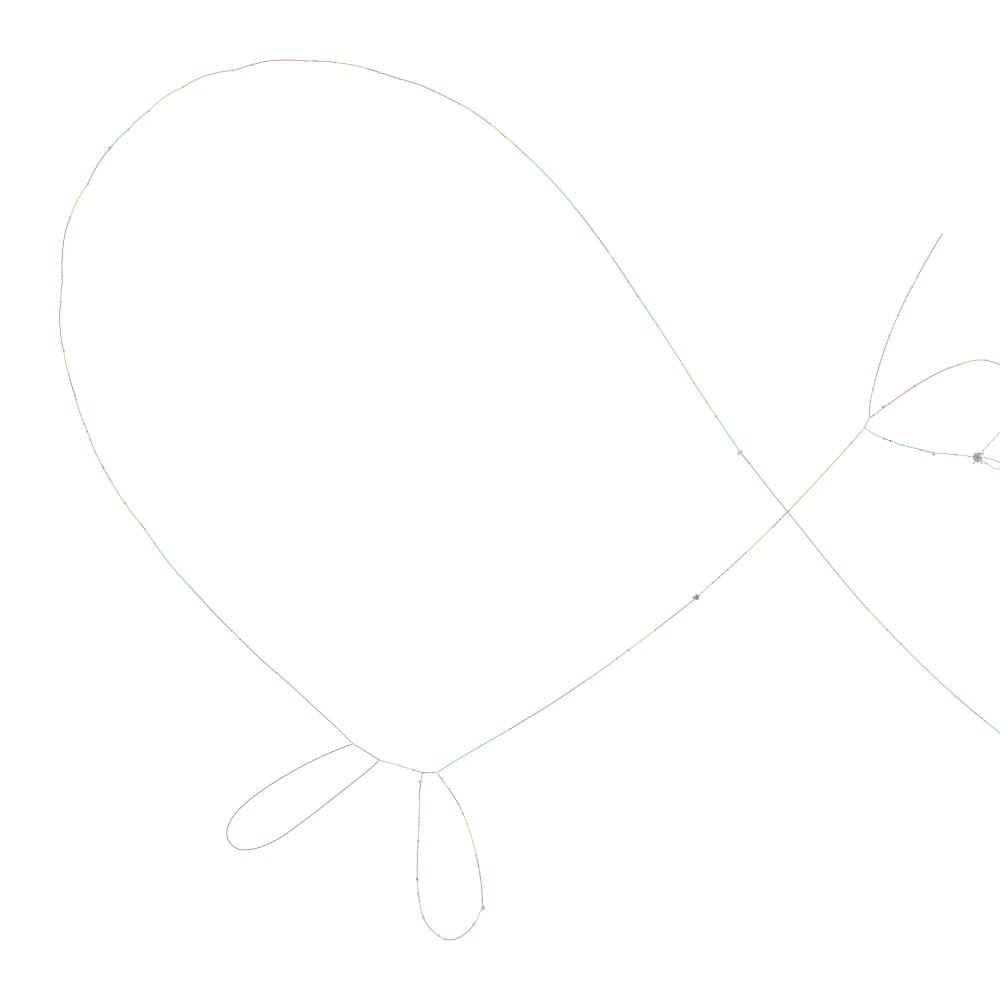

# Practical 2 - What do we do with a pangenome?

In this practical session, we will try a few visualizations and queries that let us explore our pangenome collection. Most of these steps are follow ups to the previous section, where we built various types of indexes and representations of a "pangenome" for small datasets of genome assemblies. The next question is: what can we do with these pangenomes?

**Docker Image with all the tools pre-installed:** [npmalfoy/scalable:2026](https://hub.docker.com/r/npmalfoy/scalable) (`linux/amd64`)

**Course data (FTP):** [https://ftp.ebi.ac.uk/pub/databases/metagenomics/research-team/shivakumar/scalable_course/](https://ftp.ebi.ac.uk/pub/databases/metagenomics/research-team/shivakumar/scalable_course/)

> Expected runtimes and memory below are rough guidelines from a dry-run on an Apple Silicon M5 Pro MacBook Pro (Docker `linux/amd64`). Your machine may differ.

---

## Learning objectives

In this practical you will:

1. Explore how to visualize the outputs for pangenome exploration
2. Learn what types of queries each type of pangenome index is suitable for

---


## 0) Pull the docker container and datasets

See the course informatics guide for full setup instructions. After unpacking the course archives into `datasets/` (AGCs) and `data/` (pre-built outputs) in your working directory, start an interactive session with the working directory mounted at `/course`:

**Docker:**

```bash
docker pull npmalfoy/scalable:2026
docker run --rm -it --platform linux/amd64 -v "$PWD:/course" -w /course npmalfoy/scalable:2026
```

**Singularity / Apptainer:**

```bash
apptainer pull scalable.sif docker://npmalfoy/scalable:2026

apptainer shell \
  --bind "$PWD:/course" \
  --pwd /course \
  scalable.sif
```

> Use `singularity` in place of `apptainer` if that is what your cluster provides. On Apple Silicon (or other arm64 hosts), keep `--platform linux/amd64` for Docker.

Inside the container, AGCs are under `/course/datasets`, pre-built outputs under `/course/data`, and writable outputs under `/course/data/work`.

**Course data downloads** (from the [FTP directory](https://ftp.ebi.ac.uk/pub/databases/metagenomics/research-team/shivakumar/scalable_course/)). Unpack these next to each other in your working directory (so you end up with `datasets/` and `data/`):


| Archive                       | Required?       | Contents                                                                 |
| ----------------------------- | --------------- | ------------------------------------------------------------------------ |
| `datasets_agc.tar.gz`         | yes             | AGC assemblies                                                           |
| `course_data.tar.gz`          | yes             | pre-built indexes / tool outputs / reads / MHC graph                     |
| `alignments_athaliana.tar.gz` | yes (~16G)      | `data/athaliana/alignments.paf` (needed for the `impg` step; the `.impg` index is built in Practical 1, not shipped) |
| `alignments_human.tar.gz`     | optional (~5G)  | `data/human/alignments.paf`                                              |


```bash
mkdir -p datasets
tar -xzf datasets_agc.tar.gz -C datasets
tar -xzf course_data.tar.gz
tar -xzf alignments_athaliana.tar.gz   # → data/athaliana/alignments.paf
# optional: tar -xzf alignments_human.tar.gz
mkdir -p data/work
```


To test that the tools are installed and available:

```bash
which agc ropebwt3 syng impg BandageNG panacus vg mumemto shredtools minimap2
```


---


## 1) How to use each pangenome representation

Following the previous practical, we will use the shipped *A. thaliana* indexes under `data/athaliana/` for the steps below (Practical 1’s yeast builds are a different scale). Writable outputs go under `$OUT`. Set shared paths once:

```bash
DATASETS=/course/datasets
DATA=/course/data
OUT=/course/data/work
ATHALIANA_OUT=$DATA/athaliana/tool_outputs
ATHALIANA_AGC=$DATASETS/athaliana_all.agc
ATHALIANA_FASTA_DIR=$OUT/athaliana_fastas
ANALYSIS_DIR=$OUT/analysis
mkdir -p "$OUT" "$ATHALIANA_FASTA_DIR" "$ANALYSIS_DIR"
```

First, decompress the 68 *A. thaliana* assemblies (assemblies from Lian et al., *Nat Genet* 2024) from the AGC archive into a local FASTA directory:

**Expect:** ~30 s; ~0.5–1 GB RAM.

<details>
<summary>Show AGC decompress command</summary>

```bash
agc info "$ATHALIANA_AGC"
agc listset "$ATHALIANA_AGC" | head
agc getcol -o "$ATHALIANA_FASTA_DIR" "$ATHALIANA_AGC"
ls "$ATHALIANA_FASTA_DIR" | head
```

</details>


---


### Mumemto / Shredtools

We've computed the set of multi-MUMs across the pangenome. In general for useful downstream analysis, we want the multi-MUM coverage to be >50% across the collection. Lower coverage likely indicates more dissimilar assemblies or high repeat content.

First, we will visualize the multi-MUM synteny of *A. thaliana* genomes. Since each assembly has the same number of contigs, we can split the visualization by chromosome using `mumemto viz --mode gapped`.

**Expect:** `mumemto viz` ~15–30 s and ~4 GB RAM; `shredtools extract` a few seconds and <0.5 GB.

<details>
<summary>Show mumemto command</summary>

```bash
mumemto viz -o "$ANALYSIS_DIR/mumemto.pdf" -i "$ATHALIANA_OUT/mumemto/mumemto" --mode gapped
```

</details>

<details>
<summary>Example output (multi-MUM gapped synteny)</summary>



</details>


Next, we can query a region of interest and extract syntenic regions across the pangenome using `shredtools extract`. For this exercise, we will extract the FLC gene involved in flowering using the following region: `chr5:3,173,000–3,179,000`. Precomputed outputs live under `$ATHALIANA_OUT/mumemto/` (`mumemto.bumbl`, `mumemto.bumbl.bi`, `mumemto.lengths`).

<details>
<summary>Show shredtools command</summary>

```bash
shredtools extract -o "$ANALYSIS_DIR/flc" -s 0 -r CP138175.1:3173000-3179000 --plot "$ATHALIANA_OUT/mumemto/mumemto.bumbl"
# mumemto.lengths embeds absolute FASTA paths; rewrite to the /course mount layout if needed
sed -i 's|/data/data/|/course/data/|g; s|/data/work/|/course/data/work/|g' "$ANALYSIS_DIR/flc.bed"
```

</details>

<details>
<summary>Example output (FLC locus synteny extract)</summary>



</details>

*Further reading:* Shivakumar & Langmead (2025) Mumemto: efficient maximal matching across pangenomes. https://doi.org/10.1186/s13059-025-03644-0

---


### ropebwt3

We previously generated an FM-index using ropebwt3. There are a few things we can do, all centered around finding exact matches between a query and the index.

The first command is `mem`. We will query a set of reads against the index and find all the MEMs (maximal exact match) that appear between a read and the index.

**Expect:** `mem` ~5–15 s and ~1 GB RAM; hapdiv prep + `hapdiv` on the short FLC extract a few seconds and ~1 GB.

<details>
<summary>Show ropebwt3 mem command</summary>

```bash
ropebwt3 mem "$ATHALIANA_OUT/ropebwt3/rb3.fmd" "$DATA/athaliana/reads/tanz1_1k.fq" > "$ANALYSIS_DIR/read_mems.txt"
```

</details>


Next, we can query an assembly against the index and compute kmer diversity with respect to the pangenome. This is helpful to identify regions that are highly similar or dissimilar in a query assembly with respect to the population. For this, we can use the `ropebwt3 hapdiv` command.

We've held out Tanz-1 from the ropebwt3 index (`$DATA/athaliana/holdout/Tanz-1.fa`), but it is included in the mumemto collection so we can recover its FLC locus from the BED produced above. Pull that sequence with `shredtools fasta`, then run `hapdiv` on the short FLC FASTA (querying the full Tanz-1 genome is slow on a laptop).

<details>
<summary>Show ropebwt3 hapdiv command</summary>

```bash
grep Tanz-1 "$ANALYSIS_DIR/flc.bed" > "$ANALYSIS_DIR/flc_tanz.bed"
shredtools fasta -o "$ANALYSIS_DIR/flc_fa" "$ANALYSIS_DIR/flc_tanz.bed"
ropebwt3 hapdiv "$ATHALIANA_OUT/ropebwt3/rb3.fmd" "$ANALYSIS_DIR/flc_fa/"*extract*.fa > "$ANALYSIS_DIR/hapdiv.txt"
```

</details>

*Further reading:* Li (2024) BWT construction and search at the terabase scale. https://doi.org/10.1093/bioinformatics/btae717

---


### syng

We previously built a syncmer dictionary (`.1khash`) and GBWT (`.1gbwt`) with syng. Analogous to ropebwt3's MEMs over bases, `syngmap` finds MEMs over syncmers between a query read set and the pangenome GBWT.

**Expect:** ~5–15 s; ~4 GB RAM.

<details>
<summary>Show syngmap command</summary>

```bash
syngmap -o "$ANALYSIS_DIR/syngmap" -outputIds "$ATHALIANA_OUT/syng/syng.1khash" "$ATHALIANA_OUT/syng/syng.1gbwt" "$DATA/athaliana/reads/tanz1_1k.fq"
```

</details>

*Further reading:* Durbin (2026) A run-length-compressed skiplist data structure for dynamic GBWTs supports time and space efficient pangenome operations over syncmers. https://doi.org/10.64898/2026.03.26.714584

---


### impg

We can project the same FLC gene region through the all-vs-all alignments, extract the homologous sequences across the pangenome, and build a local variation graph with `impg`.

**Expect:** FLC `impg query` ~30 s; ~0.5 GB RAM. (Rebuilding the `.impg` index, if needed, is a few seconds.)

```bash
IMPG_PAF=$DATA/athaliana/alignments.paf
IMPG_IDX=$OUT/alignments.paf.impg
```

This step needs the *A. thaliana* PAF (`alignments_athaliana.tar.gz`) and the `.impg` index built in Practical 1 (`$IMPG_IDX`). Confirm both are present:

```bash
ls -lh "$IMPG_PAF" "$IMPG_IDX"
```

If `alignments.paf` is missing, unpack that archive into your course directory (outside the container) and restart / remount so `/course/data/athaliana/alignments.paf` is visible.

If the index is missing (you did not finish the `impg index` step in Practical 1), rebuild it:

```bash
impg index -a "$IMPG_PAF" -i "$IMPG_IDX"
```

Task: Query the FLC region (`CP138175.1:3173000-3179000`) from the *A. thaliana* alignments and build a GFA graph of the homologous sequences.

<details>
<summary>Show impg command</summary>

```bash
impg query -i "$IMPG_IDX" -a "$IMPG_PAF" -r "CP138175.1:3173000-3179000" -d 1000 -x -o gfa --sequence-files "$ATHALIANA_FASTA_DIR"/*.fa -O "$ANALYSIS_DIR/flc"
```

</details>


Inputs: all-vs-all pairwise alignments (PAF), the corresponding FASTA sequences, and a query interval

Outputs: extracted homologous FASTA sequences aligned into a local GFA graph (`flc.gfa`)

*Further reading:* Sorin et al. (2026) Pangenome-based association testing between a structural variant located upstream of the KIT gene and head depigmentation across a diverse panel of cattle breeds. https://doi.org/10.1186/s12711-026-01037-w

---


### BandageNG

[BandageNG](https://github.com/asl/BandageNG) visualises assembly / variation graphs. Here we render the FLC graph built with impg above.

**Expect:** a few seconds; <0.1 GB RAM.

Task: Produce an image of the FLC variation graph.

<details>
<summary>Show BandageNG command</summary>

```bash
BandageNG image "$ANALYSIS_DIR/flc.gfa" "$ANALYSIS_DIR/flc.svg"
```

</details>

<details>
<summary>Example output (FLC variation graph layout)</summary>



</details>


Inputs: a variation graph in GFA format

Outputs: an SVG image of the graph layout

*Further reading:* Wick et al. (2015) Bandage: interactive visualization of de novo genome assemblies. https://doi.org/10.1093/bioinformatics/btv383

---


### panacus

[panacus](https://github.com/codialab/panacus) computes coverage and growth statistics over a pangenome graph (GFA). This is useful for determining how much of the pangenome is core vs accessory based on the multiple alignment encoded in the graph topology.

**Expect:** a few seconds; <0.1 GB RAM.

Task: Build an HTML report with coverage histogram and growth curves for the FLC graph from impg.

<details>
<summary>Show panacus example command</summary>

```bash
cat > "$ANALYSIS_DIR/flc_report.yaml" <<EOF
- !Gfa
  graph: $ANALYSIS_DIR/flc.gfa
  count_type: Bp
  analyses:
    - !Hist
    - !Growth
      coverage: 1,1,2
      quorum: 0,0.9,0
EOF

panacus report "$ANALYSIS_DIR/flc_report.yaml" > "$ANALYSIS_DIR/flc_report.html"
```

</details>

<details>
<summary>Example output (panacus FLC coverage & growth report)</summary>

Open the course dry-run HTML report **locally in a browser** (from a checkout of this module, or after copying the file out of the container):

[figures/p2_flc_panacus_report.html](figures/p2_flc_panacus_report.html)

> Static PNG previews of individual panacus panels are not included; the report is interactive HTML (coverage histogram and growth curves).

</details>


Inputs: a variation graph in GFA format

Outputs: an interactive HTML report (`flc_report.html`) with histogram and growth analyses

*Further reading:* Parmigiani et al. (2024) Panacus: fast and exact pangenome growth and core size estimation. https://doi.org/10.1093/bioinformatics/btae720

---


### vg giraffe

In Practical 1 we built two Giraffe indexes for the MHC region (prefer your own builds under `$OUT/vg_giraffe/`; fall back to the shipped indexes under `$DATA/human/vg_giraffe/`):

**Expect:** MHC graph mapping ~15–30 s and ~0.5–1 GB RAM; CHM13 linear mapping ~5–15 s and ~0.5 GB.

```bash
VG_DIR=$OUT/vg_giraffe
# VG_DIR=$DATA/human/vg_giraffe   # fallback: pre-built
```
- `$VG_DIR/mhc` — variation graph over the 5 human haplotypes
- `$VG_DIR/mhc_chm13` — linear CHM13 sequence for the same region

> **Why two references?** The query reads are I002C paternal HiFi, not CHM13. In [shredtools (HPRC browser)](https://vikshiv.github.io/shredtools/hprc/), query CHM13 `chr6:28381448-33301940` to see the homologous interval on I002C (`chr6:28477481-33546197`). The graph index embeds multiple human haplotypes in that region; the `mhc_chm13` index is a single linear CHM13 path for the CHM13-named coordinates. Where I002C diverges from CHM13, Giraffe on the graph can place reads on the donor-consistent haplotype while the linear index forces CHM13-centric alignments — so mapping rates, paths, and soft clips can disagree even for the same reads. How the 1k-read subset was produced is documented in the module [README](README.md) (**MHC HiFi query reads**).

Task: Align the provided human HiFi long reads with [`vg giraffe`](https://github.com/vgteam/vg/wiki/Mapping-long-reads-with-Giraffe) against **both** indexes and compare the resulting alignments.

<details>
<summary>Show solution</summary>

```bash
# map against the 5-haplotype MHC graph (long-read indexes + hifi preset)
vg giraffe -b hifi \
  -Z "$VG_DIR/mhc/mhc.giraffe.gbz" \
  -d "$VG_DIR/mhc/mhc.dist" \
  -m "$VG_DIR/mhc/mhc.longread.withzip.min" \
  -z "$VG_DIR/mhc/mhc.longread.zipcodes" \
  -f "$DATA/human/reads/i002c_mhc_1k.fa" > "$ANALYSIS_DIR/reads.mhc.gam"

# map against the linear CHM13 MHC index
vg giraffe -b hifi \
  -Z "$VG_DIR/mhc_chm13/mhc_chm13.giraffe.gbz" \
  -d "$VG_DIR/mhc_chm13/mhc_chm13.dist" \
  -m "$VG_DIR/mhc_chm13/mhc_chm13.longread.withzip.min" \
  -z "$VG_DIR/mhc_chm13/mhc_chm13.longread.zipcodes" \
  -f "$DATA/human/reads/i002c_mhc_1k.fa" > "$ANALYSIS_DIR/reads.mhc_chm13.gam"
```

</details>

Inputs: long-read Giraffe indexes from Practical 1 (`lr-giraffe`) and long HiFi reads

Outputs: GAM alignments for each index

#### Optional: compare the two GAMs (reference bias)

The HiFi query reads are **I002C paternal**, not CHM13. Aligning them to a **single linear CHM13** path is the classic *reference bias* setup: where I002C carries haplotype structure absent from CHM13, the linear index can still “force” a placement (mismatches, indels, soft clips, lower scores). The **five-haplotype MHC graph** embeds more human variation in the same interval, so Giraffe can often choose a path that fits the read better even when both indexes report similar mapping rates.

**Expect:** a few seconds per `vg stats -a` call; negligible RAM.

Task: Summarize both GAMs with `vg stats -a`, then skim the differences in aligned fraction, alignment score, and soft-clip burden.

```bash
# VG_DIR as set above for vg giraffe
echo "=== MHC pangenome graph ==="
vg stats -a "$ANALYSIS_DIR/reads.mhc.gam" "$VG_DIR/mhc/mhc.giraffe.gbz"

echo "=== linear CHM13 MHC ==="
vg stats -a "$ANALYSIS_DIR/reads.mhc_chm13.gam" "$VG_DIR/mhc_chm13/mhc_chm13.giraffe.gbz"
```

**Discuss (2–3 minutes):**

- Total **aligned** counts are often similar — what does that imply about *whether* reads map, versus *how well* they map?
- Mean **alignment score** and **perfect / gapless** counts: which index looks more confident for these reads, and why might that track donor haplotype rather than “CHM13 correctness”?
- **Softclips** and indel/substitution totals: are differences evenly spread, or concentrated in reads you would expect to be structurally divergent from CHM13?

<details>
<summary>Per-read score join (graph vs CHM13)</summary>

For a read-level view, export JSON alignments and join on read name. Positive `delta` means the pangenome-graph alignment scored higher than the CHM13-linear alignment for that read.

```bash
vg view -aGj "$ANALYSIS_DIR/reads.mhc.gam" \
  | jq -s 'map({key:.name, value:{score:(.score//0), mq:(.mapping_quality//0)}}) | from_entries' \
  > "$ANALYSIS_DIR/reads.mhc.scores.json"

vg view -aGj "$ANALYSIS_DIR/reads.mhc_chm13.gam" \
  | jq -s 'map({key:.name, value:{score:(.score//0), mq:(.mapping_quality//0)}}) | from_entries' \
  > "$ANALYSIS_DIR/reads.mhc_chm13.scores.json"

jq -n \
  --slurpfile m "$ANALYSIS_DIR/reads.mhc.scores.json" \
  --slurpfile c "$ANALYSIS_DIR/reads.mhc_chm13.scores.json" '
  ($m[0] | keys) as $names |
  [$names[] | . as $n | {
    name: $n,
    mhc_score: $m[0][$n].score,
    chm13_score: $c[0][$n].score,
    delta: ($m[0][$n].score - $c[0][$n].score)
  }] | {
    reads: length,
    graph_higher: map(select(.delta > 0)) | length,
    chm13_higher: map(select(.delta < 0)) | length,
    tied: map(select(.delta == 0)) | length,
    mean_delta: (map(.delta) | add / length)
  }'

# optional: list reads where CHM13 scored better
jq -n \
  --slurpfile m "$ANALYSIS_DIR/reads.mhc.scores.json" \
  --slurpfile c "$ANALYSIS_DIR/reads.mhc_chm13.scores.json" '
  ($m[0] | keys)[] | select($c[0][.] != null and $m[0][.].score < $c[0][.].score)
' | head
```

On course dry-run data, **most** reads have higher graph scores; the short list where CHM13 wins is worth inspecting (repeats, path choice, or near-tie scores).

</details>

<details>
<summary>Optional advanced: `vg gamcompare` (interpret carefully)</summary>

`vg gamcompare` is built to score alignments against a **known-truth** GAM (simulation or truth tags), not to pick a “winner” between two real references. The workflow below is a **teaching probe only**: it projects the CHM13-linear placements onto the pangenome graph, then asks whether those positions lie within **50 kb** (graph distance) of the pangenome-graph placements — using the **graph GAM as stand-in “truth.”**

**Do not over-interpret:** reversing truth/query swaps the verdict; neither GAM is biological ground truth for I002C; coordinate lift between CHM13-named and graph paths adds slack; and most disagreements may reflect path choice rather than mapping failure.

```bash
# project CHM13-linear alignments into coordinates on the MHC pangenome graph
vg annotate -x "$VG_DIR/mhc/mhc.giraffe.gbz" -a "$ANALYSIS_DIR/reads.mhc_chm13.gam" \
  > "$ANALYSIS_DIR/reads.mhc_chm13.on_mhc_graph.gam"

# graph mapping = reference; CHM13-linear (annotated) = query; 50 kb tolerance for long reads / lift
vg gamcompare -r 50000 -d "$VG_DIR/mhc/mhc.dist" \
  "$ANALYSIS_DIR/reads.mhc_chm13.on_mhc_graph.gam" \
  "$ANALYSIS_DIR/reads.mhc.gam" \
  -T | tee "$ANALYSIS_DIR/gamcompare_graph_truth.tsv" | head

# tally correct (1) vs incorrect (0) in column 1
tail -n +2 "$ANALYSIS_DIR/gamcompare_graph_truth.tsv" | cut -f1 | sort | uniq -c
```

On course dry-run data, even with **50 kb** slack only a handful of reads are labeled “correct” — most projected CHM13 placements are **not** within graph distance of the pangenome-graph placement. That is expected when haplotypes diverge and when `gamcompare` is used without simulated truth; treat the table as a sanity check, not a verdict on which index is “right.”

</details>

*Further reading:* Chang et al. (2025) Rapid, accurate long- and short-read mapping to large pangenome graphs with vg Giraffe. https://doi.org/10.1101/2025.09.29.678807

---


## 2) Optional: build an MHC graph with impg and compare to [minigraph-cactus](https://github.com/ComparativeGenomicsToolkit/cactus/blob/master/doc/pangenome.md)

This optional exercise rebuilds an MHC variation graph with `impg` (the workflow that used to live in Practical 1) and compares it to the shipped [minigraph-cactus](https://github.com/ComparativeGenomicsToolkit/cactus/blob/master/doc/pangenome.md) MHC graph using BandageNG and graph stats.

[impg](https://github.com/pangenome/impg) indexes and enables querying of genomic intervals across a pangenome using all-vs-all pairwise genome alignments. Running all-pairs alignments is not practical on a laptop, so we ship pre-computed human alignments (`alignments_human.tar.gz` — optional large download; unpacks to `data/human/alignments.paf`). Do **not** run `impg align` here. A companion `.impg` index for the shipped human PAF is already in `course_data` as `$DATA/human/alignments.paf.impg`. Skip this section if you did not download `alignments_human.tar.gz`.

Task: Using the shipped index and alignments, build a graph of the MHC region across the set of human genomes ([CHM13 coords](https://ftp-trace.ncbi.nlm.nih.gov/ReferenceSamples/giab/release/genome-stratifications/v3.6/CHM13@all/OtherDifficult/CHM13_MHC.bed.gz) -> chr6:28381448-33301940). Use `-o gfa:seqwish`, which skips the slow smoothing step for the purposes of this tutorial (graph induction via [seqwish](https://github.com/pangenome/seqwish)). Then visualise the impg graph and the shipped [minigraph-cactus](https://github.com/ComparativeGenomicsToolkit/cactus/blob/master/doc/pangenome.md) graph side by side with BandageNG, and compare basic graph statistics.

This step needs the human assemblies. Decompress them if you have not already, and confirm the optional human PAF is present:

```bash
AGC=$DATASETS/human.agc
FASTA_DIR=$OUT/human_fastas
mkdir -p "$FASTA_DIR"

# [wfmash](https://github.com/waveygang/wfmash) ships with impg under libexec — symlink into conda bin for --aligner wfmash
ln -sfn /opt/conda/envs/scalable_course/libexec/impg/wfmash /opt/conda/envs/scalable_course/bin/wfmash

ls -lh "$DATA/human/alignments.paf" "$DATA/human/alignments.paf.impg"
agc getcol -o "$FASTA_DIR" "$AGC"
```

<details>
<summary>Show impg query command</summary>

```bash
impg query -i "$DATA/human/alignments.paf.impg" -a "$DATA/human/alignments.paf" -r "chr6:28381448-33301940" -d 1000 -x -o gfa:seqwish --sequence-files "$FASTA_DIR"/*.fa -O "$ANALYSIS_DIR/mhc_impg" --aligner wfmash
```

</details>

Inputs: all-vs-all pairwise alignments (PAF) and the corresponding FASTA sequences

Outputs: a GFA graph for the queried MHC region (e.g. `$ANALYSIS_DIR/mhc_impg.gfa`)

### BandageNG and stats: impg vs [minigraph-cactus](https://github.com/ComparativeGenomicsToolkit/cactus/blob/master/doc/pangenome.md)

The course ships a smoothed minigraph-cactus MHC graph as `$DATA/human/mhc/mhc.full.gfa.gz`. After the impg query finishes, render both graphs and print summary stats so you can compare topology / size at a glance.

<details>
<summary>Show BandageNG and stats commands</summary>

```bash
# unpack the shipped MC graph next to the impg output
gunzip -c "$DATA/human/mhc/mhc.full.gfa.gz" > "$ANALYSIS_DIR/mhc_mc.full.gfa"

# visualise both
BandageNG image "$ANALYSIS_DIR/mhc_impg.gfa" "$ANALYSIS_DIR/mhc_impg.svg"
BandageNG image "$ANALYSIS_DIR/mhc_mc.full.gfa" "$ANALYSIS_DIR/mhc_mc.svg"

# basic graph stats (nodes / edges / length)
vg stats -z "$ANALYSIS_DIR/mhc_impg.gfa"
vg stats -z "$ANALYSIS_DIR/mhc_mc.full.gfa"
```

</details>

Inputs: the impg MHC GFA and the shipped minigraph-cactus MHC GFA

Outputs: SVG layouts for both graphs plus printed `vg stats` summaries to compare

### Optional: sequence compression (GFA vs input)

Variation graphs store sequence on **S** lines; shared haplotype structure means the total S-line sequence is often much smaller than copying the same interval from every input assembly. Compare that total to a naive upper bound: the CHM13 MHC window size times the number of FASTA files in `$FASTA_DIR` from the impg step above.

Task: For `mhc_impg.gfa` and `mhc_mc.full.gfa`, sum S-line sequence lengths (excluding `*` placeholders) and divide by the input total to get a simple compression ratio.

<details>
<summary>Show GFA vs input sequence totals</summary>

```bash
# CHM13 MHC window (same coords as the impg query): 4,920,493 bp
MHC_BP=$((33301940 - 28381448 + 1))
N=$(ls -1 "$FASTA_DIR"/*.fa | wc -l | tr -d ' ')
INPUT_BP=$((MHC_BP * N))

gfa_seq_bp() {
  awk '$1=="S" && $3!="*" { n += length($3) } END { print n+0 }' "$1"
}

for gfa in "$ANALYSIS_DIR/mhc_impg.gfa" "$ANALYSIS_DIR/mhc_mc.full.gfa"; do
  gfa_bp=$(gfa_seq_bp "$gfa")
  ratio=$(awk -v g="$gfa_bp" -v i="$INPUT_BP" 'BEGIN { if (i > 0) printf "%.3f", g/i; else print "NA" }')
  echo "$(basename "$gfa"): ${gfa_bp} bp S-lines / ${INPUT_BP} bp input → ratio ${ratio}"
done
```

</details>

The shipped minigraph-cactus MHC graph can include **more samples than the five** impg FASTAs; still use the same denominator (`MHC_BP × N` from `$FASTA_DIR`) so everyone compares graphs on equal footing in the classroom.

On course data, the MC graph is typically about **~11 Mb** of S-line sequence versus **~24.6 Mb** input (**~0.45** ratio). The impg graph uses the same five assemblies and should compress as well, but totals can differ because it was built with `-o gfa:seqwish` without MC smoothing.

*Further reading:* Hickey et al. (2024) Pangenome graph construction from genome alignments with Minigraph-Cactus. https://doi.org/10.1038/s41587-023-01793-w

*Further reading:* Lucas et al. (2026) HPRC2: A human pangenome reference with near-complete coverage of common genetic variation. https://doi.org/10.64898/2026.07.21.739710

---
